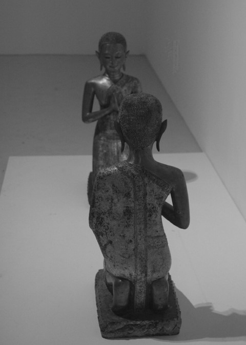

  ⟨ <a href="https://blog.naver.com/omegapassion" target="_blank">출처 - 뜻빛깔</a> ⟩

제가 그때 초대에 응하지 않았던 이유는 결코 삼킬 수 없는 것들을 탐욕스럽게 입이 터지 물어댄, 그 추한 모양새가 적나라하게 내 앞에/ 그에게 비춰짐이 부끄러웠기 때문입니다.

*토—그가 침뱉어 개워낸 흙으로 만져주어 이제야 볼수 있게된, 지금 아는 수준에서 말입니다.
