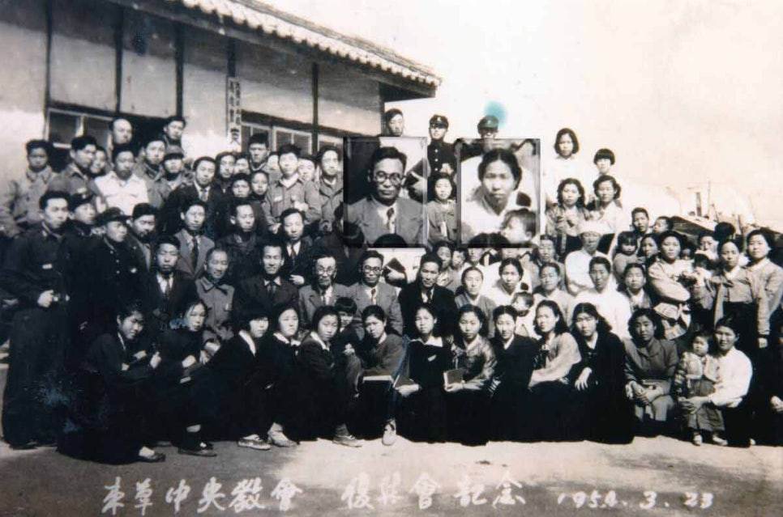

한국샬렘영성훈련원에서 영성 심화 과정을 듣고 있을 때였습니다. 과정이 분별이란 목차에 다다랐습니다. 분별을 위해 함께 나누어 읽을 책이 헨리 나우웬의 "분별력"이라 설렜습니다. 과정 중에 새로운 선생님을 만나는 것도 기대되지만, 제 마음을 따뜻하게 쓸어줬던 익숙한 저자의 목소리도 반갑습니다. 친절한 안내를 따라 그의 영적 여정을 쫓아가는 도중 한 이정표 앞에 섰습니다.

## 집으로 돌아가는 길

헨리가 소명을 찾아가는 여정엔 굴곡이 많았습니다. 심리학자와 신부로부터 대학교수, 그리고 라틴아메리카까지 여러 곳에 찍혔던 그의 발자국은 라르쉬 공동체에 이르게 됩니다. 이곳, 데이브레크에서 헨리는 하느님 품으로 돌아가기까지 10여 년을 머뭅니다. 그를 공동체에 머물게 한 초대는 간단했습니다. 라르쉬를 찾아 침묵 피정을 마친 후, 장 바니에가 한 마디를 건넵니다.

> "우리가 당신에게 집이 되어줄 수 있을 것입니다"

헨리는 집이란 이정표 덕에 하느님을 찾는 여정의 종착지를 정했습니다. 그 단어가 헨리 마음에만 울리던 것은 아닙니다. 제 마음 판에 새겨진 기억도 떠올립니다.

## 내 고향 집

눈을 감으면 어릴 적 우리 집이 눈 안에 선합니다. 할아버지와 할머니, 그리고 제가 살던 그곳엔 침묵이 두텁게 깔려 있습니다. 조부모님, 두 분다 말씀이 적었던 탓입니다. 할아버지는 책으로 가득 둘러싸인 방에 자신을 가두고 침묵과 친구가 되었습니다. 그곳에서 그렇게 하느님과 말없이 대화하고 계십니다. 할아버지의 그 분위기가 우리 교회에 이어졌습니다. 빛이 비쳐 드는 예배당에 침묵이 가득합니다. 창가에 앉아 따뜻하게 들어오는 볕을 쬐면 하느님께 안긴 것 같은 기분이 들곤 했습니다.

  ⟨ 외조부모님 - 1954년, 속초중앙교회 ⟩

## 유산으로 받은 침묵

할아버지 친구 중에 유명한 부흥사가 있었습니다. 부흥회가 유행하던 시기에 우리 교회를 찾았습니다. 그런데 그때도 할아버지 모습은 이전과 다르지 않았습니다. 며칠 지나 우리 교회도 언제 그랬느냐 다시 제 모습을 찾았습니다. 그날 처음 체험한 통성기도, 그 열기도 좋았지만 저는 할아버지와 나누던 침묵이 익숙합니다. 할아버지는 어떻게 기도하셨을까요? 다 자란 이후, 제 어머니가 전해주었습니다. "기도는 옆 사람에게 들리지 않게 조용히 하느님께만 올려라". 할아버지는 제게 침묵을 유산으로 물려주셨습니다. 다른 곳에서도 응당 그렇게 기도할 수 있을 것 같았습니다. 그러나, 여느 교회에서도 우리 교회, 우리 집과 같은 침묵을 찾기 쉽지 않았습니다.

## 집을 떠남

할아버지와 같은 목회자로 살 자신이 없었습니다. 내가 믿던 것이 하느님이 아닌 할아버지 아니였을까 하는 의심도 들었습니다. 그 때문에 신학교를 떠난 지 10여 년이 흘렀습니다. 교회와도 등을 졌습니다만, 정작 하느님에 대한 갈망은 멈춘 적 없습니다. 단지 제가 애써 무시하고 거부하고 있었을 뿐입니다. 그러던 어느 날, "사람은 무엇으로 사는가?"란 화두에 매달리게 되었고, 이가 숨겨져 있던 씨앗을 터트립니다. 발아된 마음은 오직 하느님, 그 근원으로 다시 저를 이끌었습니다.

## 집 앞 골목길

다시 목회자를 준비하게 된 제게 분별할 것이 생겼습니다. 어느 교단, 신학대학원을 선택해야 하는 기로에 섰습니다. 할아버지가 몸담으셨던 교단보단 제가 다니던 신학교가 저와 잘 맞았습니다. 이 둘 사이에서 기도하다 중간 성향의 교단, 교회를 선택하게 됩니다. 여느 교회처럼 신자 개인의 내면에 치중하는 곳이었습니다. 이것만으로는 제 목마름이 채워지지 않았습니다. 당시 홍대 근처에서 칼국수를 팔던 두리반이 철거 위기에 놓였습니다. 두 주인이 부당한 퇴거에 맞서 여러 이웃과 함께 연대하며 싸우고 있었습니다. 그곳에서 예배가 드려진다는 것을 알게 되었습니다.

## 민중 영성

목요일 저녁, 성찬례를 위해 한용걸 신부가 강원도 화천에서 홍대 두리반을 찾습니다. 준비해 온 영대를 하나둘씩 착의하면서 예전이 시작됩니다. 전기가 들어오지 않아 한낮에도 어둡던 두리반 이층이 여느 교회와 성당같은 성소로 변모합니다. 예전 내내 뜨거운 기운에 취했습니다. 창가에 놓여 있어선지, 아니면 두 주인의 긴 시간 고난을 담았기 때문인지 곰삭아버린 포도주를 성찬례를 위해 받았습니다. 이를 목으로 넘기는 순간 골고다에서 예수님이 흘렸던 피가 떠올랐습니다. 그날, 민중과 나누는 영성을 체험했습니다. 이러한 자리에 머물고 싶었습니다. 한편, 다니던 교회에선 부흥회가 시작되었습니다. 제 갈 길은 이날로 정해졌습니다.

## 타는 목마름

하느님의 얼굴을 담은 민중이 만들어내는 영성의 자리는 뜨겁습니다. 자신의 삶을 태우는 열기이니 그러하겠지요. 그 뜨거운 기운에 취해있을 때, 가끔 목이 마른다는 느낌을 받곤 합니다. 그럴 땐 할아버지, 할머니와 함께 지내던 집을 떠올립니다.

우리 교회처럼 빛이 비쳐 들고 있습니다. 그 따스함에 눈을 감습니다. 잠에 든 것 같이 시간이 훌쩍 지납니다. 한 친우의 목소리로 깨어납니다. 의문사한 한 군 장병의 이야기가 그의 내면에서 길어진 것 같습니다. 그렇게 떠올랐던 울림은 파장을 내곤 이내 사라집니다. 또다시 침묵으로 돌아갑니다. 그때 종교 친우회 서울 모임, 퀘이커에서 나눴던 예배 분위기가 익숙했습니다. 덕분에 제 마음 깊은 곳에서 할아버지 방에 가득했던 침묵을 꺼냈습니다.

## 침묵의 여러 빛깔

이후로 침묵을 찾아 여러 곳을 찾아다녔습니다. 예수회 센터에서 예수마음배움터, 그리고 여러 책으로 침묵을 담은 영성에 귀 기울였습니다. 그러나 제 갈망은 채워지지 않았습니다. 제 갈증이 제 욕심을 닮은 탓일까요. 물론 민중 영성, 그 자리는 놓지 않았습니다. 그 뜨거움이 저마저 태울 것 같던 시기에 샬렘을 만납니다. 김오성 목사가 인도하던 기도학교였습니다. 하느님의 은총 덕에 의심했던 마음을 침묵이 채우기 시작합니다. 이후로 샬렘의 여러 과정을 거치며 영성을 익혀갑니다. 그 발걸음이 오늘, 영성 심화 과정에 이르렀습니다. 제 여정에 샬렘이 없었다면 이라는 가정을 할 수 없습니다. 샬렘이 친구가 되어 하느님께 나아가는 여정이 오늘도 이어집니다.

## 자연을 만남

2018년, 샬렘에서 영적 동반자 과정을 듣고 있을 때였습니다. 은혜로 오래된 친구이자 선생을 재회하게 되었습니다. 그때, 그 기억을 아래와 같이 기록했더군요.

> 좋은 차경 덕에 잊고 있던 이때쯤, 어린 시절 기억이 떠올랐다. 교회로 오르는 언덕길을 내려가다 보면 집사님 사택이 있었고, 그 앞에 커다란 평상이 놓여있었다. 뛰어놀다 집으로 돌아가는 길에 언덕을 타고 부는 시원한 바람에 잡혀 평상에 앉는다. 이내, 눈 안엔 저 멀리 산등선이 가득하다. 눈길은 능선을 따라 미끄럼을 탄다.
>
> 사람이 누운 것 같기도 하고, 소가 누운 것 같기도 하던 산이 노고산이란 걸 알게 되었을 즈음, 높다란 건물들이 경쟁하듯 올라섰고, 눈앞에 가득 찼던 산은 간데없었다. 사실 그 이전에, 효창공원 담을 넘어 자연을 벗 삼아 뛰어놀던 소년은 신촌과 명동을 가득 채운 사람들과 옷가지에 관심을 두게 된 지 오래다. 소년의 동경은 그렇게 자라 현실이 되었다. 그는 주위에 풀 한 포기 없이도 살 수 있는 도시인이 되었다.
>
> 2년 전, 이 시기 즈음 오솔길을 따라 집으로 돌아가던 길이다. 양옆으로 도열한 나무를 하나씩 눈으로 밟아가다, 한 나무 옹이에 눈길이 머물렀다. 그 안에 뛰고 있는 심장이 보이는 것 같아 손을 가져다 댔다. 뛰는 심장 고동 소리가 들릴라 한참을 그리 있었다. 그날 이후로, 쉬는 날이면 도시의 담을 넘어 소년 시절 친구를 만나는 일이 잦아졌다. 그리고 자연스럽게 나는 생명을 찾아 미끄럼 타듯 산을 오르내리고 있다. 시원한 바람이 분다.
>
> — 내 작은 소회, 2018

침묵을 통한 기도와 하느님 사랑을 이웃과 나누는 일로만 제 목마름이 채워지지 않았습니다. 산을 찾아 잠시 자연에 머물 때 비로소 퍼즐 조각이 맞춰 진 것 같았습니다. 산에 오를수록 그곳에 더 오래 머물고 싶은 마음이 커져 갑니다. 이 때문에 야영을 준비하고 있습니다. 그렇게 산 안에 텐트를 펴놓으면 그곳이 제 집이 될 수 있을까요?

## 어제와 다른 오늘

집과 가까운 수락산에 들살이할 만한 장소를 찾아 오릅니다. 좀 외진 곳에 야영지를 찾았다 한 주 후에 돌아가면 그곳을 찾을 수 없습니다. 사람 발이 닿지 않으면, 금세 그 자리를 풀이 차지하기 때문입니다. 산의 모습은 한주, 아니 하루가 다르게 변화합니다. 그 자리에 몇천 년을 버티고 선 산이지만, 품고 있는 생명들은 매일 새롭게 태어났다 집니다. 겉모습만이 아닌 그 속살 전부를 산이라 한다면 우리 앞에 어제의 산은 없습니다. 자연은 우리 앞에 오늘로 존재합니다. 그렇게 서서 그 안에 품은 하느님의 신성한 광채를 발합니다. 그리고, 우리에게 진리를 전합니다.

## 오늘, 내 집

산처럼 우리에게도 어제와 같은 오늘은 없습니다. 제가 그리 찾아 헤매던 조부님과 지내던 집도 이제는 존재하지 않습니다. 제가 오늘까지 찾아 헤맨 것을 자연은 욕심이라 합니다. 침묵으로 삶을 잉태하는 산처럼, 저 또한 오늘 하루만치의 기도를 드릴 뿐입니다. 이를 통해 하느님을 이곳에 초대합니다. 헨리가 말한 대로 누구와 언제, 어디서 등의 재료가 내 집을 만들어 주지 않습니다. 내 집이란 표징은 하느님이 이곳에 함께 하시냐에 달렸습니다.

이제 내 집을 침묵으로 준비해야 합니다. 이 때문에 내 기억에서 그리운 이가 사라져 버리지 않을까 두렵기도 합니다. 이러한 제게 많은 스승과 친구들이 위로를 건넵니다. 내 집에서 예수님과 함께 떡과 잔을 나눌 때 할아버지와 할머니가 함께하신다고 말이지요. 어찌 이분들뿐이겠습니까. 그 성찬의 자리에 친절한 헨리뿐 아니라 하느님을 사랑하는 모든 이들과 함께 할 수 있습니다. 그 잔치의 자리가 나와 우리 모두를 초대합니다. 이를 위해 오늘도 침묵의 노동을 이어갑니다.
