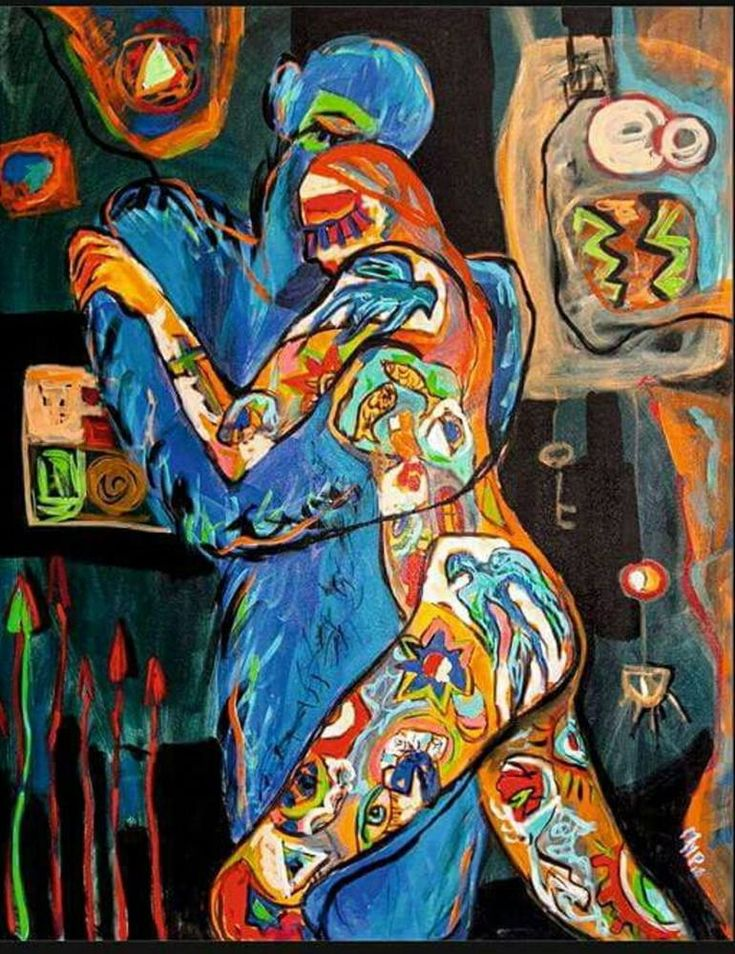

  ⟨ Lovers Painting - Mihaela Panaitescu ⟩

&nbsp;
## 1. 사랑은 가능한가

우리는 돈으로 무엇이든 살 수 있는 시대에 살고 있습니다. 그래도, 값을 매길 수 없는 몇가지가 남아 우리에게 희망을 주고 있지요. 앞으로 이야기 나누게 될 '사랑'도 그 가운데 하나입니다. 수많은 책과 영화, 노래가 돈과의 전쟁에서 '진실한' 이라는 전술로 오랫동안 사랑을 사수했습니다. 그러나, 20세기 초, 김중배의 다이아몬드를 이겨낸 전략이 아직까지 유효할까? 란 의문을 떨칠 수 없습니다. 이제부터 저는 이 질문에 대한 대답을 찾기위해 헨리 나우웬의 책 ⟪친밀함⟫ 가운데, ⟨사랑의 도전⟩ 장을 살피려 합니다. 헨리 나우웬을 떠올리면 '사랑받는 자'가 연상될 정도로 '사랑'과 '인간 존재'는 그와 떼어놓을 수 없는 주제입니다. 그가 말하는 사랑이 그의 첫번째 책에서는 어떻게 설명되고 있을까요? 그는 먼저 사랑이 벌어지는 인간 관계를 두가지로 특정합니다. 처음 살펴볼 인간관계는 권력 또는 탈취의 형태로 그 결과가 파괴를 낳습니다. 나우웬은 다음으로 사랑 혹은 용서의 형태를 이야기하는데, 이는 창조에 닿아 있습니다. 이 둘을 정리한 후에, 마지막으로 "사랑은 가능한가? 에 대해 알아보려합니다.
&nbsp;
## 2. 권력, 탈취에 밭에선 무엇이 나나

헨리 나우웬은 우리가 사는 세계가 권력, 탈취의 형태로 가득 찼다고 합니다. 다음과 같은 사람이 있습니다. 자신 안에 존재하는 어둠을 없애야 할 것으로 여기는 이입니다. 그는 남에 대한 사랑보다는 미움이 앞서는 자신을 견딜 수 없습니다. 이러한 모습을 남들이 안다면 자기를 사랑하지 않을 것이라 생각하며 두려움에 떨지요. 또한, 두려움은 다음과 같은 경우에도 나타납니다. 내 안에 있는 아픔과 약점을 상대가 알아챘을 때, 상대가 이를 이용하여 나를 탈취 할 수 있다는 것을 알게 될 때입니다. 내 권력을 빼앗은 상대는 자기가 원하는 대로 나를 끌고 갈 것이라는 생각합니다. 이런 관계에선 상대가 내 약점이 될 만한 과거를 알고 있다는 사실이 무기가 됩니다. 내 약점은 내가 아니라, 남이 나를 보는 시점에서 만들어지기 때문입니다. 우리는 내가 아니라 다른 이가 매긴 기록에 의해 인생을 살고 있습니다. 어려서부터 어른들의 판단과 평가를 받고, 중요한 시기마다 시험으로 등급이 메겨져 진로가 결정되지요. 이러한 구조에서, 인간은 자연스레 남에게 탈취당하지 않고, 남을 통제할 수 있는 권력을 쫓게 됩니다. 그래야만 좋은 학교, 좋은 직업, 좋은 동반자를 다른 사람들에게 뺏기지 않기 때문입니다. 오늘 우리는 빼앗길 두려움에 쫓기며, 빼앗기지 않기 위해 권력을 쫓는 사람들이 만들어가는 세상에서 살고 있습니다.

연애라고 다르겠습니까. 헨리 나우웬에 따르면, 이러한 세상에서 연애는 사랑이 아니라 전쟁에 가깝습니다. 사람들은 연인 에게도 자신을 털어놓을 수 없지요. 자신의 약점을 숨겨야 사랑한다는 사람과의 상황을 통제하여 권력을 잡을 수 있기 때문입니다. 솔직한 자신을 드러낼 수 없으니 부자연스럽게 상대가 원하는 정답만 이야기 합니다. 이러한 상대와 함께 있는 시간이 편할 수 없지요. 함께 있을 때 느끼는 감정이 사랑보다 두려움에 가깝기 때문입니다. 결국 이러한 관계는 상대를 자신의 방식대로 다룰 수 있게 되면 승리하게 되는 정복 만을 꿈꾸는 전쟁을 닮았습니다.

헨리는 이러한 연애의 끝은 모든 전쟁이 그러했듯 파괴에 닿을 것이라 합니다. 내가 승리자가 되려면 내게 약점은 있을 수 없지요. 내 약점이 될 수 있는 실수와 실패, 그리고 잘못을 어둠, 악으로 분류합니다. 그 결과 내 안에 악을 보듬으려는 온유와 긍휼, 그리고 사랑마저 불필요한 감정이요 약점이라 부릅니다. 자신이 권력을 뺏은 사람에게만 파멸이 기다리지 않습니다. 누군가에게 자신의 권력도 빼앗길 지 모르지요. 이렇게 끝없이 이어질 악순환 가운데 사랑은 꿈일 뿐입니다. 약점을 품을 수 없는 세대의 끝은 창조보다 파멸에 가깝습니다. 우리에게 파멸이라는, 권력과 탈취가 낳을 결과 밖에 남은 것이 없을까요? 이러한 질문 앞에 헨리 나우웬은 창조를 품은 또 다른 인간관계를 소개합니다.
&nbsp;
## 3. 사랑, 용서는 창조를 낳는다

헨리 나우웬은 여기서 권력과 탈취가 아닌 사랑과 용서에 기반한 인간관계를 안내합니다. 한 사람이 고백합니다. 자신의 실수, 실패 그리고 잘못들을 상대에게 내놓습니다. 상대가 그를 탈취하고 파괴하지 않으리라는 믿음에서 말이지요. 그 용기 있는 고백을 시작으로 새로운 삶이 열립니다. 이와 같이, 자신을 깨고 밖으로 나오는 고백을 회심이라 합니다. 회심한 사람은 주위의 말에 개의치 않습니다. 세상이 "이상주의자, 몽상가, 낭만주의자" 라 부를지 몰라도 그는 회심이란 사랑의 가능성을 발견했습니다. 사랑의 기초에 선 사람이 그 고백을 듣는다면 이 사람을 품을 것입니다. 더 나아가 듣는 것에 멈추지 않고, 자신의 약점을 그에게 고백하기 시작할겁니다. 이렇게 서로에게 온전한 자신의 참 자아를 고백하는 데에 사랑이 있습니다. 사랑이란 이런 약한 사람들의 친밀한 사귐에서 시작됩니다. "우리는 서로에게 의존할 수 밖에 없어"라는 고백은 너와 나를 초대합니다. 이 연약함을 나누는 만남에서 삶은 새로운 세계로 들어갑니다. 사랑 안에서 용서받지 못하는 것은 없습니다. 벌어질 갈등을 두려워하거나, 논쟁을 피하려 하지 않아도 됩니다. 두려움 없이 속마음을 드러낼 수 있다는 것이 사랑이 아닌가요. 한 사람이 한 사람을 믿으며 세상의 두려움을 이기고, 다시 태어났습니다. 막 태어나 취약한 자신을 나눈 이들 사이의 친밀한 사귐은 권력과 탈취가 아닌 사랑과 용서 아래 묶여있습니다.

헨리 나우웬에 따르면, 이러한 관계는 세 가지 특성을 가진다. 첫째, 서로 '진실'합니다. 진실한 서로는 관계를 위한 거짓에서 탈출할 수 있습니다. 숨겨야 할 필요가 없으니 두려움이 없습니다. '사람 위에 사람 없다' 란 고백 아래 서로에게 충실하게 됩니다. 둘째, '부드럽습니다'. 믿음을 가지고 내게 다가온 상대를 안아주고 어루만집니다. 셋째, 사랑은 '무장 해제' 상태입니다. 우리는 사랑하는 사람과 만날 때도 능숙하게 뒷짐에 총칼을 숨겨 놓을 수 있습니다. 그가 준 상처를 용서하지 않고 마음에 쌓아놓거나, 그가 하는 행동의 동기를 의심하는 것이 무기가 될 수 있지요. 그러나, 경계하는 군인도 밥을 먹을 때는 무장을 풉니다. 잠을 잘 때는 무기와 더욱 멀어집니다. 사랑하는 연인이 벌거벗고 자기 몸의 약한 부분까지 숨기지 않고 내어주는 모습을 보십시오. 서로 세심하게 자신을 드러내어 완전한 무장 해제를 이루는 자유에 닿아 있습니다. 이 때, 연인의 만남은 용서가 되고, 벌거벗은 몸은 수치가 아닌 공유의 갈망을 일으킬 것입니다. 우리의 최대 약점은 공동 힘의 원천입니다. 서로 약점을 온전히 내 보일 때 새 생명이 태어납니다. 서로 '진실하고', '부드럽게', '무장해제' 된 곳에 사랑이 깃듭니다. 이것이 사랑의 신비입니다.

권력은 파괴를 가져오고, 우리의 약함은 창조를 가져옵니다. 우리는 약함으로 완전한 발육과 성숙에 이루는 첫발을 뗄 수 있습니다. 그렇다면 우리는 창조를 낳기 위해 사랑할 수 있을까요?
&nbsp;
## 4. 사랑, 그 모험으로 초대

이제 드디어 물을 차례입니다, "사랑이 가능한가요?". 헨리는 당신이 사랑을 택했다 하더라도 탈취의 형태를 바라는 갈망을 버리기 힘들 것이라고 합니다. 여전히 권력과 탈취의 형태가 우리를 두텁게 뒤덮고 있기 때문입니다. 이러한 현실에서, 헨리 나우웬은 탈취의 구조를 바꿀 방법을 찾을 게 아니라, 구조를 뛰어넘어 진실한 사랑을 찾을 가능성을 위해 노력하자고 합니다. 현실의 공포와 두려움에 견디다 못해 연인을 찾아, 서로의 품에 파고듭니다. 이러한 관계가 잠시 쉴만한 피난처를 찾는 욕망에 불과하다면 이것이 사랑일까요? 그 피난처를 떠나면, 우리는 다시 살기 위해 권력을 쫓을 수 밖에 없습니다. 모두들, 이 상태에 멈추고 맙니다. 그러나 저자는 악순환이라는 마침표를 신앙의 도약으로 뛰어넘습니다. 사랑의 가능성을 보여준 예수님을 통해 사랑의 모험으로 우리를 초대합니다.

예수는 사랑이 안전하다는 것을 자신의 삶으로 보이셨습니다. 십자가에 매달릴 두려움을 우리에 대한 사랑으로 뛰어넘었습니다. 취약해진 자신을 온전히 드러내고 용기 있게 죽음을 맞이한 일로 그리스도라 불리웠습니다. 이를 통해 죽음으로부터 다시 살아나셨습니다. 사랑의 예수가 내민 손을 헨리 나우웬은 맞잡고 있습니다. 사랑은 증명할 수 있는 것이 아니지요. 사랑이라는 초대에 응하여 적극적으로 반응하여 사실을 발견하는 일 일뿐입니다. 예수를 따르는 이들이 권력과 탈취의 삶을 살 수 없습니다다. 예수가 자신의 연약함을 온전히 드러내서 죽음의 사슬을 끊고, 목숨을 버려서 영생을 얻으신 일로 사랑했기 때문입니다.

헨리 나우웬은 사랑을 하려면 오늘 팽배한 권력 또는 탈취의 구조를 뛰어넘어야 한다고 한니다. 권력의 구조에선 승자로 살아남기 위해서는 약한 것들을 매일 부정해야 하지요. 이렇게 매일 상대와 자신의 약함을 죽이는 악순환이 반복되는 세상의 끝은 파멸 뿐입니다. 역설적이게도, 우리는 약함때문에 서로를 사랑할 수 있습니다. 자신의 약함이 상대의 약함에 닿을 것이라는 믿음 아래 무기를 내려놓아봅시다. 자신의 약함을 통해 우리 먼저 세상에 숨구멍을 내었던 예수를 기억하면서 말입니다. 그가 약한 사람들의 사귐에 우리를 초대합니다. 우리 앞엔 그 사랑의 초대에 응하냐, 마느냐 만 남아 있습니다.
