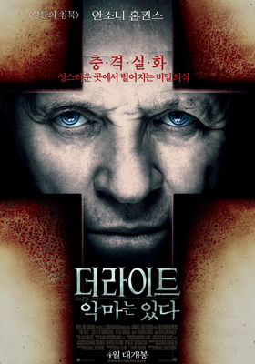

  ⟨ 영화 - 더 라이트: 악마는 있다 ⟩

&nbsp;
내가 자란 환경이 그래서인지, 어려서 공포영화를 좋아했다. 그중에서도 종교—특히 기독교 전통을 깔고 진행되는 오컬트 물을 즐겨보았다. 악마를 처치하는 일을 나도 해야 할 일인 양 숨죽이며 지켜보았다. 그 눈안에 한 믿음이 깔려 있었다. 결국 전지전능한 신이 이길 것이다. 지금 악마나 귀신에게 고난 받아 곧 죽을 것 같은 주인공은 이 고행을 이겨 낼 것이다. 이를 통해 나 또한 믿음을 키웠던 것 같다.
&nbsp;
어느 날, 오컬트 물이 이성이 신비를 무지하거나 몽매하다 여기는 시대에 악마나 귀신을 통해 초월적 존재를 설명하기 위한 장치임을 알게 되었다. 결국 종교는 믿는 자의 것일 텐데, 왜 굳이 공포를 대동한 악을 통해 사람들에게 신을 증명해야 하냐는 데에 흥미를 잃을 수밖에 없었다. 엑소시스트나 오멘과 같은 작품이 그러했다.
&nbsp;
그렇게 마음속에 묻어 두고 있던 작품들이 가까이에서 다시 소환되기 시작했다. 검은 사제들이나 사바하에서 장재현 감독은 서구 오컬트 형식을 빌려와 우리 것으로 옮겨오다가, 파묘에 이르러 이 장르를 토착화시켰다. 거기다 더 나아가 나홍진 감독은 곡성에서 "우리가 고난받을 때 신은 어디에 있는가?"란 신정론 문제를 녹여냈다. 주제와 내용, 이를 살리는 극 자체의 구성까지 내가 잊지 못하는 오컬트 작품을 뛰어넘는 표현을 해내었다. 결국 묻어 두었던 오컬트에 대한 내 관심을 되살리기 시작했다. 당시 내가 신을 바라보는 렌즈가 바뀌기도 했다. 신의 힘은 무언가를 위에서 짓누르는 통제가 아니라, 사랑을 통해 발휘된다는 것을 알게 되었다. 나홍진 감독이 신과 악마의 싸움 안에서 희생받는 민중을 곡성을 통해 위로했다지만, 나는 그 위로를 넘어 민중 곁에서 함께 고난받는 예수를 바라보고 있다.
&nbsp;
그렇게 오컬트 작품들을 찾던 와중, 더 라이트에서 한 독백과 만나게 된다. 선한 마음을 지녔으나 그 마음이 신을 자신의 주로 고백하는 데까지는 닿지 못한 청년이 있다. 형편에 떠밀려 도망치듯 신학교에 들어갔지만, 서품을 앞두고도 끝내 믿음을 갖지 못한다. 그렇게 의심하던 신학생이 노신부의 퇴마를 처음 보고 나오는 길이었다. 그런데 정작 그 노신부가 자기도 늘 확실함을 찾아 헤매는 회의주의자라며 건네는 말, 그것이 이 독백이다.
&nbsp;
> 믿음을 온통 잃어버리는 때가 있다.  
> 내가 대체 무얼 믿는지 알 수 없는 날들, 몇 달.  
> 신인지 악마인지, 산타클로스인지 팅커벨인지.  
> 하지만…  
> …나는, 그저 사람이다.  
> 약한 사람이다. 나에겐…  
> …아무런 힘이 없다.  
> 그런데도 내 안을 자꾸만 파고 긁어대는 무언가가 있다.  
> 하느님의 손톱 같은. Feels like God's fingernail.  
> 그러다 끝내 그 아픔을 더는 견디지 못하고…  
> …나는 떠밀려 나온다,  
> 어둠에서…  
> …다시 빛으로.  
> ...I get shoved out from the darkness, back into the light.  
> 뭐, 그런 것.
&nbsp;
오컬트의 주제의식이 무엇이냐 하는 것보다, 결국 나를 붙든 건 이 독백이었다. 그의 고백은 곧 내 입술 위에 얹어질 수밖에 없었다. 나 또한 매일 의심하다 지쳐, 그가 보지 못할 것이라 여기며 어둠 안에 웅크려 있을 때가 많다. 그러다, 내 가슴 깊은 곳을 건드리는 소리가 들려온다. 신부는 그것을 하느님의 손톱이라 부르고, 함석헌 선생님은 '하느님의 발길에 채여서'라 하셨다. 결국 이 모든 것이 은총이며, 이를 통해 나도 다시 기도의 자리로, 다시 민중의 곁으로 설 수 있게 된다. 이것이 신비롭다.
